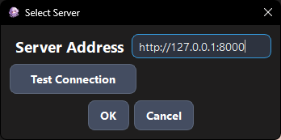
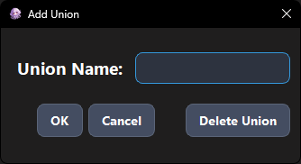
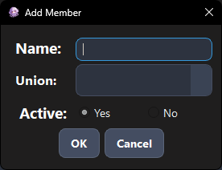
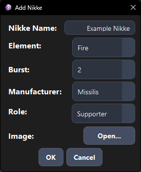
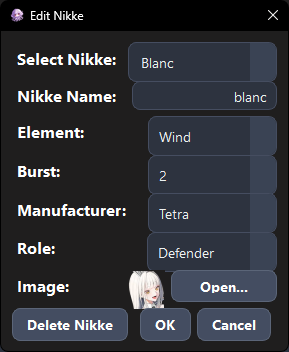
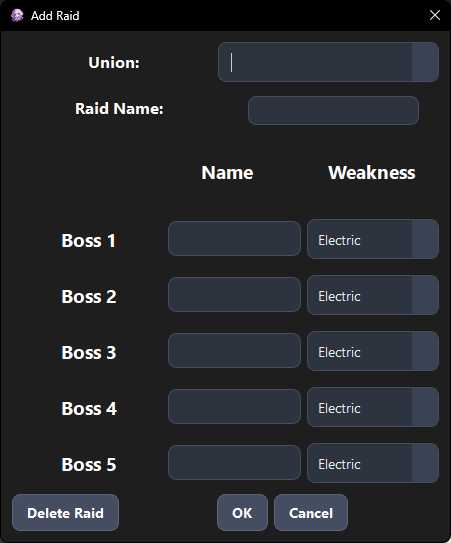
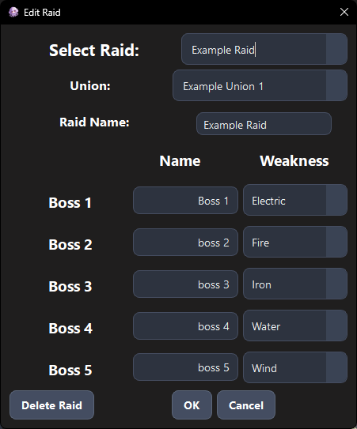
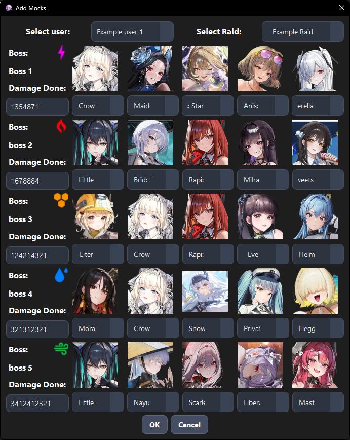
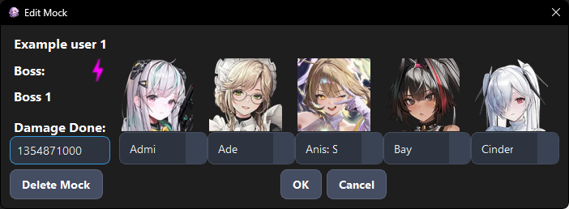

# Lib

**Lib** is a desktop application for managing **NIKKE Union Raid** groups.

It helps Union management organize and keep track of:

* Users
* Unions
* Nikkes
* Raids and bosses
* Teams
* Mock damage
* Damage rankings
* Raid attempts
* NIKKE images
* Overall raid progress

> **Note:** Lib is currently a work in progress. This first version is intended to be run locally. The desktop application runs on your computer, while the backend and database run locally through Docker.

---

# Getting Started on the Backend

This guide is written for users who are not familiar with programming or Docker.

For the first version of Lib, you will need:

1. **Docker Desktop**
2. **The Lib project files**
3. **The Lib desktop application (`Lib.exe`)**

You do **not** need to install Python, PostgreSQL, FastAPI, or any other programming dependencies manually.

---

# 1. Install Docker Desktop

Download and install **Docker Desktop** for Windows.

After installing it, start Docker Desktop and make sure it is running before continuing.

Docker Desktop is required because Lib's backend and database run inside Docker containers.

---

# 2. Download Lib

You can download the project from GitHub using either of these methods.

### Option A — Download as ZIP

On the GitHub repository page:

1. Click **Code**.
2. Click **Download ZIP**.
3. Extract the ZIP file somewhere on your computer.

You should end up with a folder similar to:

```text
Lib/
├── Backend/
├── Client/
└── README.md
```

### Option B — Clone the repository

If you already have Git installed:

```powershell
git clone <repository-url>
cd Lib
```

---

# 3. Configure the Backend

Open the `Backend` folder:

```powershell
cd Backend
```

The backend needs a `.env` file containing its database configuration.

Create a file named:

```text
.env
```

inside the `Backend` folder.

It should contain:

```env
POSTGRES_DB=ur_manager
POSTGRES_USER=ur_manager
POSTGRES_PASSWORD=change_this_password

DATABASE_URL=postgresql+psycopg2://${POSTGRES_USER}:${POSTGRES_PASSWORD}@db:5432/${POSTGRES_DB}

API_URL=http://127.0.0.1:8000
```

### Important

The `.env` file contains configuration that should **not** be uploaded to GitHub.

Do not commit your `.env` file or share it publicly.

For this local version, you can choose your own PostgreSQL password.

For simplicity, avoid special characters such as `$` or `@` in the PostgreSQL password if possible, as they can require additional escaping in environment variables.

---

# 4. Start the Lib Backend

Make sure Docker Desktop is running.

Open PowerShell in the `Backend` folder and run:

```powershell
docker compose up -d --build
```

The first startup may take several minutes.

Docker will automatically:

1. Create the PostgreSQL database.
2. Create the Lib backend container.
3. Create the required Docker volume.
4. Build the backend image.
5. Start the FastAPI API.
6. Connect the backend to PostgreSQL.

You do not need to manually install PostgreSQL.

---

# 5. Check That the Backend Is Running

Run:

```powershell
docker compose ps
```

You should see the backend and database containers running.

The database should eventually show a healthy status if a health check is configured.

You can also check the backend logs:

```powershell
docker compose logs backend
```

Look for a message similar to:

```text
Application startup complete.
```

If the backend is running correctly, the API should be available at:

```text
http://localhost:8000
```

The interactive API documentation is available at:

```text
http://localhost:8000/docs
```

You normally do not need to use the API documentation to use Lib. It is mainly useful for testing and development.

---

# 6. Download the Lib Desktop Application

The desktop application is distributed as a Windows executable.

Go to the repository's **Releases** section and download:

```text
Lib.exe
```

You do not need to install Python or PySide6 to run the executable.

You can place `Lib.exe` anywhere convenient, such as your Desktop.

---

# 7. Start Lib

Before opening `Lib.exe`, make sure the Docker backend is running.

Then double-click:

```text
Lib.exe
```

The application should connect to the locally running backend.

For the local version, the server address should be:

```text
http://127.0.0.1:8000
```

If Lib provides a server selection or connection screen, use that address.

---


# 8. First-Time Setup

After starting Lib for the first time, the Union management can be configured.

A typical setup is:

```text
Union
  ↓
Users
  ↓
Raids
  ↓
Nikkes
  ↓
Mock Damage
  ↓
Rankings / Attempts
```

### Create a Union

Create the Union that will be using Lib before anything else.


You can also edit it later.

### Add Users

Add the all members and assign them to the appropriate Union.



### Add Nikkes

The program comes with a select number of nikkes, newer releases were not yet added, but you can do it easily yourself by clicking on the menu Nikke > Add Nikke.



You can also edit them if needed.



### Create Raids

Create the raids belonging to the appropriate Union and configure their bosses and weaknesses.


           


### Add Mock Damage to your union members.

     


---

# Using Lib

Once the initial setup is complete, Lib can be used to manage the Union Raid's mock damage.

The application provides:

* **User management**
* **Union management**
* **NIKKE management**
* **Raid management**
* **Mock damage tracking**
* **Damage rankings**
* **Attempt tracking**
* **NIKKE image management**

The selected Union determines which users and raids are available in the relevant parts of the application.

---

# Stopping Lib

When you are finished using Lib, you can simply close the desktop application.

The backend containers can remain running, or you can stop them.

To stop the backend:

```powershell
docker compose down
```

This stops the containers but **does not delete your database data**.

To start Lib again later:

```powershell
docker compose up -d
```

And this is for stopping the WSL service from eating your RAM when you're not hosting the database. 
```powershell
wsl --shutdown
``` 


You do not need to use `--build` every time.

---

# ⚠️ Important: Do Not Delete the Database Volume

Avoid running:

```powershell
docker compose down -v
```

unless you intentionally want to delete the Docker volumes.

The PostgreSQL database is stored in a Docker volume so that your data survives when the containers are stopped.

Using:

```powershell
docker compose down
```

is safe for normal shutdown.

Using:

```powershell
docker compose down -v
```

can delete the database and its stored data.

---

# Troubleshooting

## Lib cannot connect to the server

First make sure Docker Desktop is running.

Then open PowerShell in the `Backend` folder and run:

```powershell
docker compose ps
```

If the containers are not running, start them:

```powershell
docker compose up -d
```

You can also check the backend logs:

```powershell
docker compose logs backend
```

Make sure the API is available at:

```text
http://localhost:8000
```

---

## The backend does not start

Check the backend logs:

```powershell
docker compose logs backend
```

Also check the database:

```powershell
docker compose logs db
```

If you need help diagnosing the problem, these logs are useful when reporting an issue.

---

## Lib.exe does not open

Make sure you downloaded the latest release of `Lib.exe`.

Windows may also display a security warning when running an executable downloaded from the internet. If Windows shows a warning, verify that the file was downloaded from the official Lib GitHub release before allowing it to run.

---

# Architecture

Lib uses a client-server architecture.

For the current local version, everything runs on the same computer:

```text
┌──────────────────────────┐
│       Lib.exe            │
│    PySide6 Desktop       │
└────────────┬─────────────┘
             │
             │ HTTP
             ▼
┌──────────────────────────┐
│     FastAPI Backend      │
│      Docker Container    │
└────────────┬─────────────┘
             │
             │ SQLAlchemy
             ▼
┌──────────────────────────┐
│       PostgreSQL         │
│      Docker Container    │
└──────────────────────────┘
```

The desktop application communicates with the backend through HTTP.

The backend handles application logic and database access.

PostgreSQL stores the persistent application data.

---

# Technology Stack

### Client

* Python
* PySide6
* Qt Designer
* Requests
* PyInstaller

### Backend

* Python
* FastAPI
* SQLAlchemy
* Alembic
* PostgreSQL
* Uvicorn

### Infrastructure

* Docker
* Docker Compose

---

# Project Structure

```text
Lib/
├── Backend/
│   ├── alembic/
│   │   ├── versions/
│   │   └── ...
│   ├── Dockerfile
│   ├── compose.yaml
│   ├── requirements.txt
│   └── ...
│
├── Client/
│   ├── GUI/
│   ├── logic/
│   ├── images/
│   ├── Lib.spec
│   └── ...
│
└── README.md
```

---

# Development

The following information is intended for developers working on Lib. Normal users do not need these commands.

## Client Development Environment

The client can be run directly from Python during development.

From the `Client` directory:

```powershell
python -m venv venv
venv\Scripts\activate
pip install -r requirements.txt
```

The Windows desktop application can be packaged using PyInstaller:

```powershell
pyinstaller Lib.spec
```

The generated executable will be placed in:

```text
Client/dist/
```

The `build/` and `dist/` directories are generated build artifacts and are not committed to Git.

---

## Backend Development

The backend dependencies are installed inside the Docker image.

After changing backend dependencies or Docker configuration, rebuild the backend:

```powershell
docker compose up -d --build
```

Useful Alembic commands:

```powershell
docker compose exec backend alembic current
docker compose exec backend alembic upgrade head
docker compose exec backend alembic check
```

To enter the backend container:

```powershell
docker compose exec backend bash
```

If Bash is unavailable:

```powershell
docker compose exec backend sh
```

---

# Database Migrations

Lib uses **Alembic** to manage changes to the PostgreSQL database schema.

Pending migrations can be applied with:

```powershell
docker compose exec backend alembic upgrade head
```

To check the current migration:

```powershell
docker compose exec backend alembic current
```

To check whether the SQLAlchemy models and database schema are synchronized:

```powershell
docker compose exec backend alembic check
```

A synchronized database should report:

```text
No new upgrade operations detected.
```

Normal users should not need to manually run migrations unless specifically instructed to do so when installing a new version.

---

# Development Roadmap

Planned development includes:

* Completing client/backend integration
* Authentication and authorization
* Improved Union management
* Improved raid management
* More comprehensive validation
* Automated tests
* Improved error handling
* Improved API documentation
* Production deployment
* Additional client versions that do not require users to manage their own backend
* Easier installation and updating

The roadmap may change as development continues.

---

# Contributing

Lib is currently a personal work-in-progress project.

The project is primarily being developed as a learning project while exploring:

* Backend development
* REST APIs
* Database design
* SQLAlchemy
* PostgreSQL
* Database migrations
* Docker
* Client-server architecture
* Desktop application development

Suggestions, bug reports, and improvements are welcome as the project develops.

---

# License

This project is currently provided without a specified open-source license.
